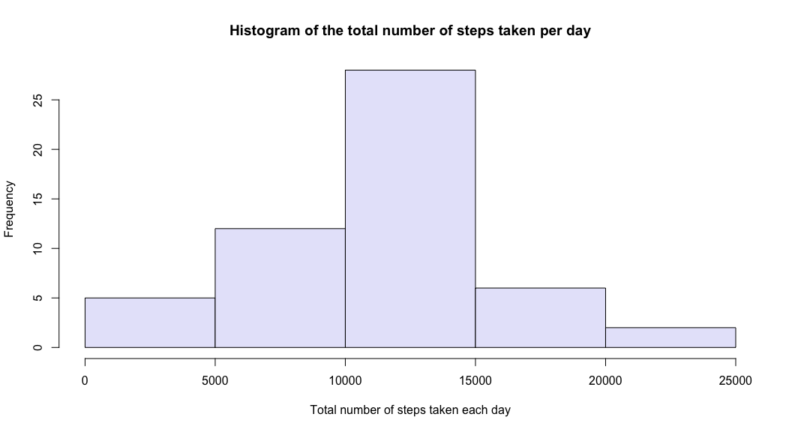
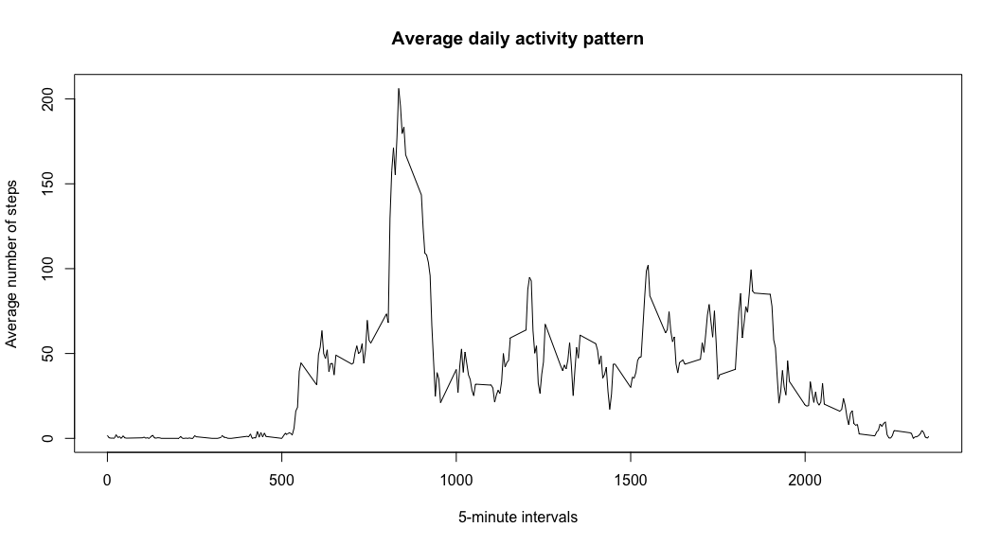
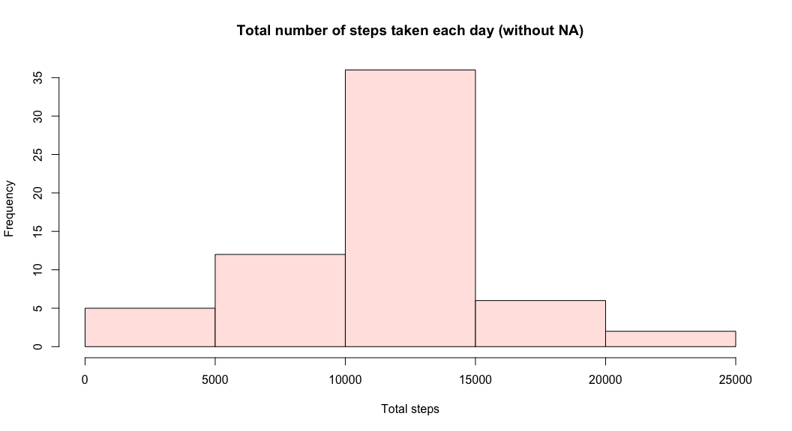
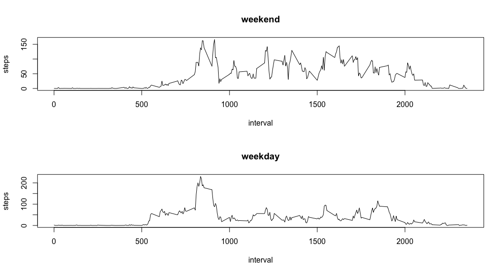

# Reproducible Research: Peer Assessment 1


## Loading and preprocessing the data

After retreving the data, we will clean up the data by converting the date format of the dataset so as to calculate the min max value.


```r
# let's first unzip and read the data into a dataframe
act <- read.csv(unzip("activity.zip"))

# now set the column with dates to the appropirate ate type
act$date <- as.Date(act$date , format = "%Y-%m-%d")

# agregate new dataframe per total steps / day and name the columns 
act.day <- aggregate(act$steps, by=list(act$date), sum)
names(act.day)[2] <- "steps"
names(act.day)[1] <- "date"

# agregate new dataframe per total steps / interval and name the columns 
act.interval <- aggregate(act$steps, by=list(act$interval), sum)
names(act.interval)[2] <- "steps"
names(act.interval)[1] <- "interval"

# agregate new dataframe with mean number of steps per interval and name the columns
act.m.interval <- aggregate(act$steps, by=list(act$interval), mean, na.rm=TRUE, na.action=NULL)
names(act.m.interval)[1] <- "interval"
names(act.m.interval)[2] <- "mean.steps"
```

## What is mean total number of steps taken per day?

First we calculate the total number of steps, then we calculate the mean and median steps in a day. Then we will plot a histogram of the total number of steps taken for each day.

1. Total number of steps in a day:

```r
hist(act.day$steps, col = "lavender", main = "Histogram of the total number of steps taken per day",
     xlab = "Total number of steps taken each day")
```

 

3. The mean steps per day are:

```r
mean(act.day$steps, na.rm = TRUE)
```

```
## [1] 10766.19
```

3. The median steps per day are:

```r
median(act.day$steps, na.rm = TRUE)
```

```
## [1] 10765
```

## What is the average daily activity pattern?
1. To calculate the average daily activity pattern, we divide the total number of steps in the interval by the total number of days. Then we create a time-series plot of the 5-minute interval and the average number of steps taken, averaged across all days


```r
plot(act.m.interval$interval, act.m.interval$mean.steps, type = "n", main = "Average daily activity pattern", xlab = "5-minute intervals", ylab = "Average number of steps") 
lines(act.m.interval$interval, act.m.interval$mean.steps, type = "l") 
```

 

2. The five-minute interval that contains the maximum number of average steps per day is 

```r
act.m.interval[which.max(act.m.interval$mean.steps), 1]
```

```
## [1] 835
```

## Imputing missing values
1. The total number of missing value is:

```r
sum(is.na(act$steps))
```

```
## [1] 2304
```

2. Replace the missing values with the mean of the interval from the act.m.interval dataframe.

```r
# merge
act.miss <- merge(act, act.m.interval, by = "interval", sort= FALSE)
#replace
act.miss$steps[is.na(act.miss$steps)] <- act.miss$mean.steps[is.na(act.miss$steps)]
```

3. Create a new dataset without the missing data.

```r
act.nona <- act.miss[, c(2,3,1)]
```

Finally, we compare the data from new and old dataset.

```r
act.day.new <- aggregate(act.nona$steps, by=list(act.nona$date), sum)
names(act.day.new)[1] <-"day"
names(act.day.new)[2] <-"steps"
```

4. Histogram of total number of steps without the missing vdata NA

```r
hist(act.day.new$steps, col = "mistyrose",
     main = "Total number of steps taken each day (without NA)",
     xlab = "Total steps")
```

 

Mean steps per day now is:

```r
mean(act.day.new$steps)
```

```
## [1] 10766.19
```

Median steps per day now is:

```r
median(act.day.new$steps)
```

```
## [1] 10766.19
```

Conclusion:
Mean value is the same as before replacing the missing values, while the median is a negligibly lower.

## Are there differences in activity patterns between weekdays and weekends?
1. Start with creating a new factor variable in the dataset with two levels - ???weekday??? and ???weekend???.

```r
# Weekday or Weekend?
wday <- function(date) {
    if (weekdays(as.Date(date)) %in% c("Saturday", "Sunday")) {
        "weekend"
    } else {
        "weekday"
    }
}

# Set the 'wday' factor variable as the new column 
act.nona$wday <- as.factor(sapply(act.nona$date, wday))
```

2. panel plot containing a time series plot (i.e. type = "l") of the 5-minute interval (x-axis) and the average number of steps taken, averaged across all weekday days or weekend days (y-axis)

```r
par(mfrow=c(2,1))
for (type in c("weekend", "weekday")) {
    steps.type <- aggregate(steps ~ interval, data = act.nona, subset = act.nona$wday==type, FUN = mean)
    plot(steps.type, type = "l", main = type)
}
```

 
